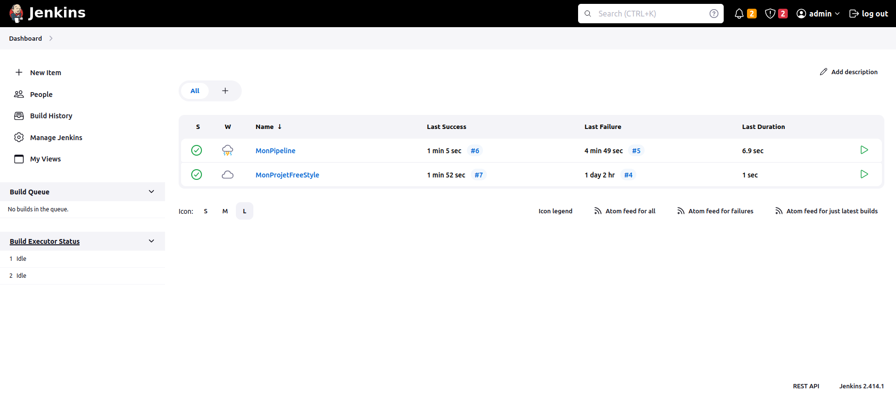

# Tpjenkins

## Objectives

- Create a FreeStyle Project.
- Create a Pipeline Project with a Jenkinsfile.
- Understand Continuous Integration.

## Part 1: FreeStyle Project

### Create a FreeStyle Project

1. Click "New Item" on the Jenkins dashboard.
2. In the window that opens:
   - Name your FreeStyle project (e.g., "MyFreeStyleProject").
   - Choose "FreeStyle Project."
   - Click "OK" to create the project.

### Configure the FreeStyle Project

1. In the FreeStyle project configuration page, under "Source Code Management," configure your SCM (e.g., Git).
2. Under "Build Triggers," enable "Poll SCM" and set the cron expression to check SCM every 5 minutes (`*/5 * * * *`).
3. Under "Build," add build steps using shell commands with `echo` for progress messages.

### Run the FreeStyle Project

1. Click "Save" to save the FreeStyle project configuration.
2. Click "Build Now" to execute the project.
3. Monitor the build progress by clicking on the project and checking the build logs.

## Part 2: Pipeline Project

### Create a Pipeline Project

1. Go back to the Jenkins dashboard.
2. Click "New Item."
3. In the window that opens:
   - Name your Pipeline project (e.g., "MyPipeline").
   - Choose "Pipeline" as the project type.
   - Click "OK" to create the project.

### Configure the Pipeline Project

1. In the Pipeline project configuration page, you don't need to set up "Poll SCM" triggers as pipelines you select Pipeline script from SCM as the pipeline definition.
2. choose Git as SCM and then put your git repository that contains the Jenkinsfile.

## My jenkins projecrts status after building them 

